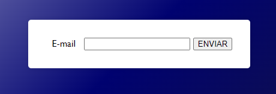
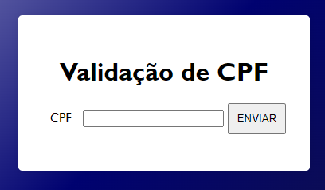

# Projeto de Validação de Email e CPF

## Introdução
Este repositório contém os projetos de validação de email e CPF desenvolvidos em JavaScript. O objetivo é documentar os recursos e a lógica utilizados em cada validação.

## Validação de Email

### Recursos Utilizados
* **Expressões Regulares:** Fornecem um padrão para validar o formato do endereço de email.
* **JavaScript puro**: Toda a lógica de validação é implementada utilizando JavaScript sem frameworks externos.
* **HTML simples**: O projeto não precisou de uma completude muito grande, o minimalismo também foi utilizado de uma forma que facilite o entendimento.
* **CSS versatil** O css foi utilizado para estilizar o projeto e resaltar o foco da avaliação.

## Estrutura dos Projeto

* **cpf.html**: Arquivo principal que contém a base do projeto html de validação de CPF.
* **main.css**: Arquivo usado para estilizar e facilitar o entedimento das ações.
* **cpf.js**: Arquivo JavaScript com a lógica de validação do CPF.
* **email.html**: Arquivo principal que contém a base do projeto html de validação de Email.
* **email.js**: Arquivo JavaScript com a lógica de validação de Email.

## Como Utilizar

  * Abrir o arquivo index.html: Abra o arquivo index.html em um navegador web.

  * Inserir o CPF: Digite o número de CPF no campo fornecido.
  
  * Clicar em "ENVIAR": O resultado da validação será exibido abaixo do botão.

# Projeto de email
 
* O projeto email se baseia na validação de um Email, feita no Java script.

## Como funciona
* Primeiramente você deve colocar seu email.
* Caso deixe vazio irá aparecer um aviso em um pop-up "O campo está vazio".
* Caso você coloque letras aleatórias, a mensagem que irá aparecer é "Coloque um email válido".
* Se digitar um email corretamente, irá aparecer "Seu email é válido"

  

# Projeto de CPF

* Primeiramente você deve colocar seu CPF corretamente,
* Caso deixe vazio irá aparecer um aviso em um pop-up "O campo está vazio".
* Caso você coloque números aleatórios, a mensagem que irá aparecer é "Coloque um CPF válido".
* Se digitar um CPF corretamente, irá aparecer "seu CPF é válido"

  

